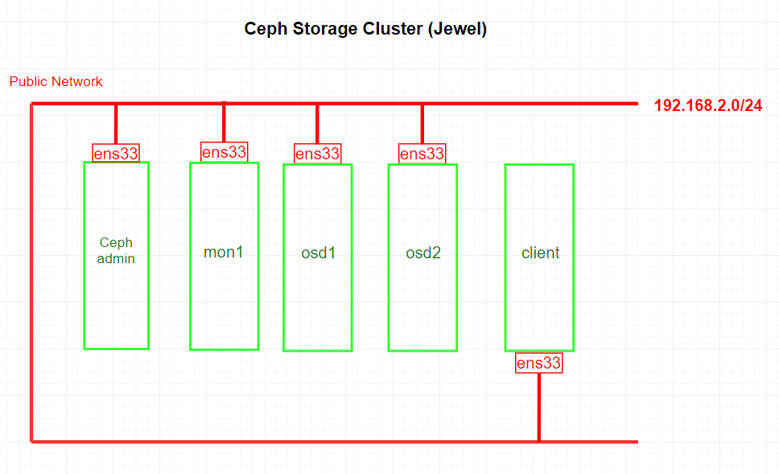
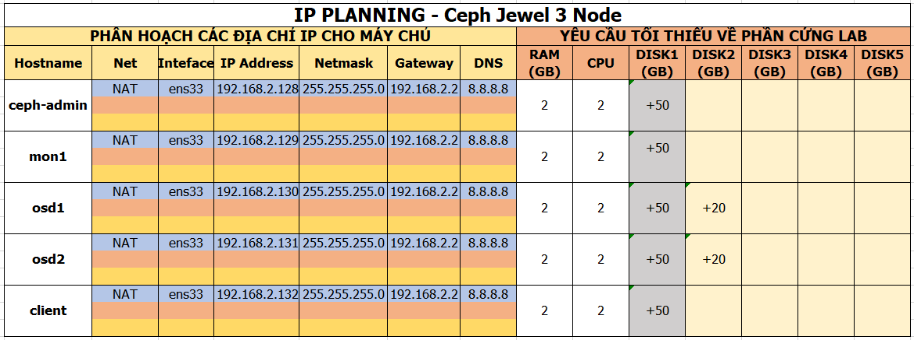
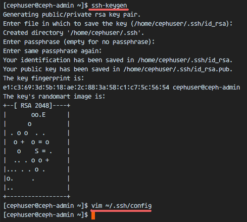
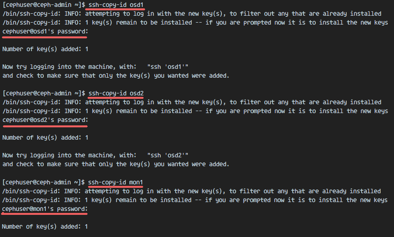
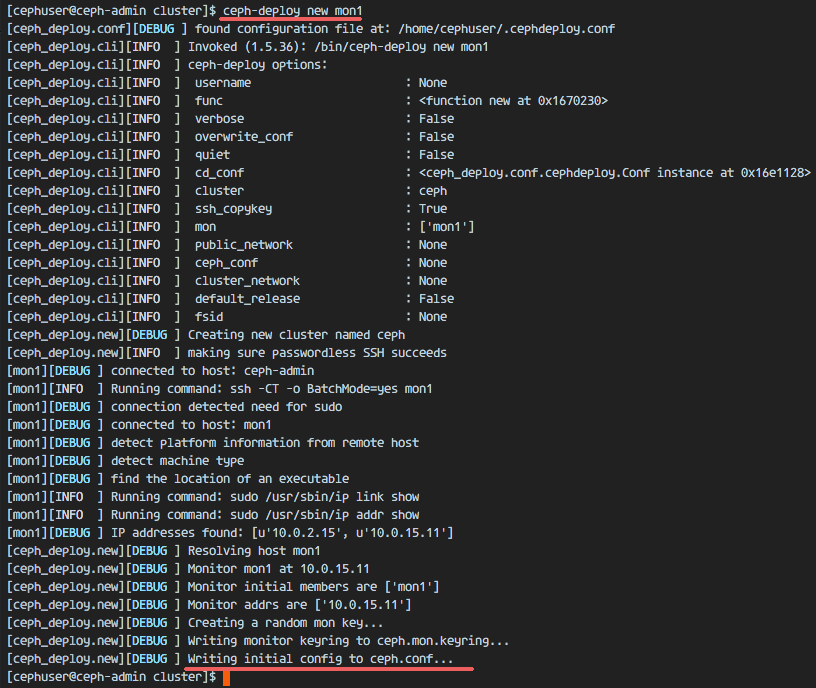
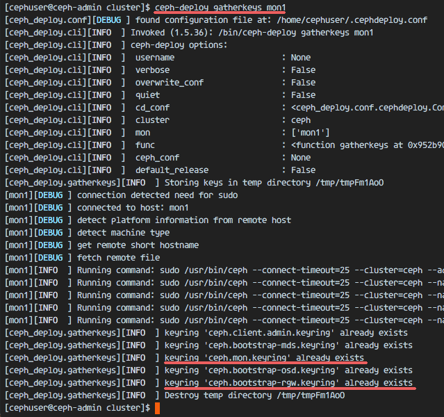
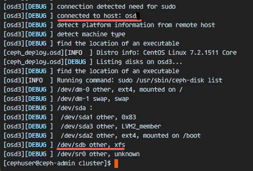
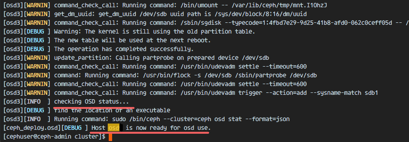
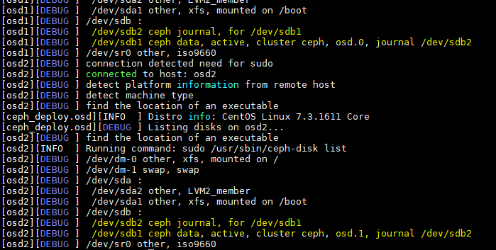
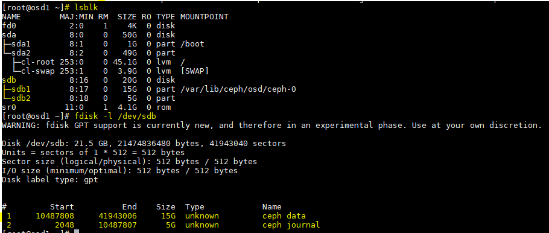

# Cài đặt Ceph Storage Cluster trên CentOS 7 (Ceph jewel)
---
## Tổng quan
[Tổng quan về Ceph](tong-quan-ceph.md)

## Chuẩn bị
### Sơ đồ

### Về tài nguyên
__Yêu cầu sử dụng 5 node, tất cả cài đặt CentOS__


## Cài đặt
### Phần 1 - Cấu hình chuẩn bị trên tất cả các node
#### Bước 1: Tạo Ceph User
Tạo Ceph user 'cephuser' trên tất các các nodes.
```
useradd -d /home/cephuser -m cephuser
passwd cephuser
```
Cấp quyền root cho user vừa tạo
```
echo "cephuser ALL = (root) NOPASSWD:ALL" | sudo tee /etc/sudoers.d/cephuser
chmod 0440 /etc/sudoers.d/cephuser
sed -i s'/Defaults requiretty/#Defaults requiretty'/g /etc/sudoers
```
#### Bước 2: Cấu hình NTP
Sử dụng NTP đồng bộ thời gian trên tất cả các Node.
> Ở đây sử dụng NTP pool US.

```
yum install -y ntp ntpdate ntp-doc
ntpdate 0.us.pool.ntp.org
hwclock --systohc
systemctl enable ntpd.service
systemctl start ntpd.service
```

#### Bước 3 (Tùy chọn): Nếu chạy tất cả node trên VMware, cần sử dụng công cụ hỗ trợ
```
yum install -y open-vm-tools
```

#### Bước 4: Hủy bỏ SELinux
```
sed -i 's/SELINUX=enforcing/SELINUX=disabled/g' /etc/selinux/config
```

#### Bước 5: Cấu hình Host File

Cấu hình trên tất cả các node
```
vim /etc/hosts

# content
192.168.2.128 ceph-admin
192.168.2.129 mon1
192.168.2.130 osd1
192.168.2.131 osd2
192.168.2.132 client
```

Cấu hình hostname trên các node theo tên riêng
```
hostnamectl set-hostname <Tên node tương ứng>

# VD
hostnamectl set-hostname ceph-admin
hostnamectl set-hostname mon1
...
```
> Ping thử tới các host, kiếm tra Network

> VD: ping -c 3 mon1

### Phần 2: Cấu hình SSH Server
> __Cấu hình trên ceph-admin node__

Sẽ sử dụng admin node để cấu hình các node monitor và osd.

#### Bước 1: Truy cập ceph-admin
```
ssh root@ceph-admin
```
> Sử dụng admin node để cài đặt các node còn lại, vì vậy ceph-admin node cần có khả năng truy cập tới các node còn lại.

#### Bước 2: Tạo ssh-key
```
ssh-keygen
```
> Để khoảng trắng trên các lựa chọn


#### Bước 3: Cấu hình ssh file
```
vim ~/.ssh/config

# content
Host ceph-admin
        Hostname ceph-admin
        User cephuser

Host mon1
        Hostname mon1
        User cephuser

Host osd1
        Hostname osd1
        User cephuser

Host osd2
        Hostname osd2
        User cephuser

Host client
        Hostname client
        User cephuser
```


Thay đổi quyền trên file
```
chmod 644 ~/.ssh/config
```

Chuyển ssh-key tới các node còn lại
```
ssh-keyscan osd1 osd2 client mon1 >> ~/.ssh/known_hosts
ssh-copy-id osd1
ssh-copy-id osd2
ssh-copy-id mon1
ssh-copy-id client
```


> Yều cầu nhập passwd trong lần đầu tiền truy cập



### Phần 3: Cấu hình Firewalld
#### Tùy chọn 1: Cấu hình dựa theo lab
Trong lab ta sẽ bỏ qua cấu hình firewalld (cấu hình trên tất cả các node)
```
systemctl stop firewalld
systemctl disable firewalld
```
#### Tùy chọn 2: Cấu hình firewalld (Chưa kiểm chứng)
##### Bước 1: Cấu hình firewalld trên ceph-admin
Kiểm tra firwalld
```
ssh root@ceph-admin

systemctl start firewalld
systemctl enable firewalld
```
Mở port 80, 2003, 4505-4506
```
sudo firewall-cmd --zone=public --add-port=80/tcp --permanent
sudo firewall-cmd --zone=public --add-port=2003/tcp --permanent
sudo firewall-cmd --zone=public --add-port=4505-4506/tcp --permanent
sudo firewall-cmd --reload
```

##### Bước 2: Cấu hình firewalld trên ceph monitor (mon1)
Kiểm tra firwalld
```
ssh root@mon1

systemctl start firewalld
systemctl enable firewalld
```
Mở port sau trên Ceph monitor
```
sudo firewall-cmd --zone=public --add-port=6789/tcp --permanent
sudo firewall-cmd --reload
```

##### Bước 3: Cấu hình trên node osd 1 - 2
Mở port 6800-7300 trên mỗi port osd node: osd1, osd2

```
ssh osd1    # ssd osd2

sudo systemctl start firewalld
sudo systemctl enable firewalld
sudo firewall-cmd --zone=public --add-port=6800-7300/tcp --permanent
sudo firewall-cmd --reload
```

### Phần 4: Cấu hình Ceph OSD
Theo cấu hình thiết lập cơ bản, 2 Ceph OSD sẽ gồm 2 disk:
- /dev/sda = root partition.
- /dev/sdb = 20GB dựa theo lab.
Ta sẽ sử dụng /dev/sdb để cấu hình Ceph disk

#### Thực hiện trên từng node osd (osd 1, osd 2)
Kiểm tra thông tin disk
```
sudo fdisk -l /dev/sdb
```
Đinh dạng XFS FS với GPT partition thông qua command
```
sudo parted -s /dev/sdb mklabel gpt mkpart primary xfs 0% 100%
sudo mkfs.xfs /dev/sdb -f
```
Kiểm tra lại partition vừa định dạng
```
sudo blkid -o value -s TYPE /dev/sdb
```

### Phần 5: Thiết lập Ceph Cluster
Tại phân này, ta sẽ cài đặt tât cả các Ceph node thông qua ceph-admin node.

#### Bước 1: Truy cập ceph-admin node
```
ssh root@ceph-admin
```

#### Bước 2: Cài đặt ceph-deploy trên ceph-admin node
Thêm Ceph repo và cài đặt gói thiết lập Ceph với yum cmd
```
sudo rpm -Uhv http://download.ceph.com/rpm-jewel/el7/noarch/ceph-release-1-1.el7.noarch.rpm
sudo yum update -y && sudo yum install ceph-deploy -y
```

#### Bước 3: Tạo mới Ceph Cluster config
Tạo cluster directory
```
mkdir cluster
cd cluster/
```

Tạo mới cluster config với 'ceph-deploy' command, thiết lập monitor node = 'mon1'
```
ceph-deploy new mon1
```


Cấu hình ceph.conf
```
vim ceph.conf

# Add thêm
public network = 192.168.2.0/24
osd pool default size = 2
```

#### Bước 4: Cài đặt Ceph tới tất cả các node
Cài đặt Ceph tới tất cả các node từ ceph-admin node.
```
ceph-deploy install ceph-admin mon1 osd1 osd2
```
> cmd sẽ tự động cài đặt ceph tới tất cả các node: mon1, osd1-2 và ceph-amdin

Thiết lập ceph-mon tới mon1 node
```
ceph-deploy mon create-initial
```

Tạo monitor key, kiểm tra thiết lập key
```
ceph-deploy gatherkeys mon1
```


#### Bước 5: Thêm OSD tới Cluster
Sau khi Ceph được cài đặt tới các node, ta cần thêm tiến trình OSD tới cluster. Các tiến trình OSD sẽ tạo data, journal partition trên disk /dev/sdb.
```
ceph-deploy disk list osd1 osd2
```


> Nhận thấy /dev/sdb đang ở dạng XFS format

Xóa /dev/sdb partition tables trên tất cả node với zap option
```
ceph-deploy disk zap osd1:/dev/sdb osd2:/dev/sdb
```
> cmd trên sẽ xóa toàn bộ data trên /dev/sdb tại Ceph OSD node

Thiết lập OSD node
```
ceph-deploy osd prepare osd1:/dev/sdb osd2:/dev/sdb
```

Nếu thành công


Kích hoạt OSD
```
ceph-deploy osd activate osd1:/dev/sdb1 osd2:/dev/sdb1
```

Kiểm tra sau khi thiêt lập
```
ceph-deploy disk list osd1 osd2
```


Theo kết quả, /dev/sdb sẽ có 2 phân vùng
- /dev/sdb1 - Ceph Data
- /dev/sdb2 - Ceph Journal

Kiểm tra tại OSD node
```
fdisk -l /dev/sdb
```


Thiết lập management-key liên kết các node
```
ceph-deploy admin ceph-admin mon1 osd1 osd2
```
Thiết lập quyền truy cập file trên tất cả các node
```
sudo chmod 644 /etc/ceph/ceph.client.admin.keyring
```

> Sau bước trên thiết lập Ceph Cluster hoàn tất

### Phần 6: Kiểm tra Ceph setup
#### Bước 1: Kiểm tra tại Ceph monitor node
Truy cập ceph monitor node
```
ssh root@mon1
```
Kiểm tra cluster health
```
sudo ceph health
```
Kiểm tra cluster status
```
sudo ceph -s
```


> Có thể thây thông tin cơ bản health = OK

> Ceph monitor IP = 192.168.2.129:6789

> Có 2 OSD server, và có thể sử dụng 30gb dung lượng trên cluster

## Nguồn
https://www.howtoforge.com/tutorial/how-to-build-a-ceph-cluster-on-centos-7/
